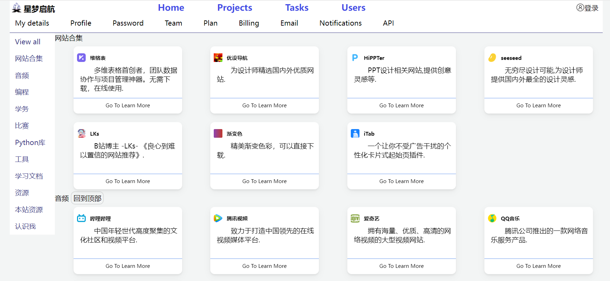
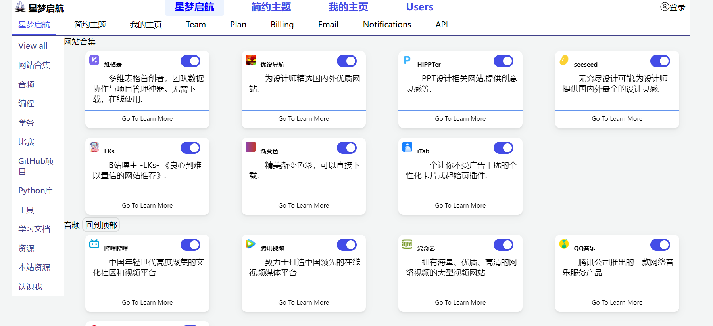
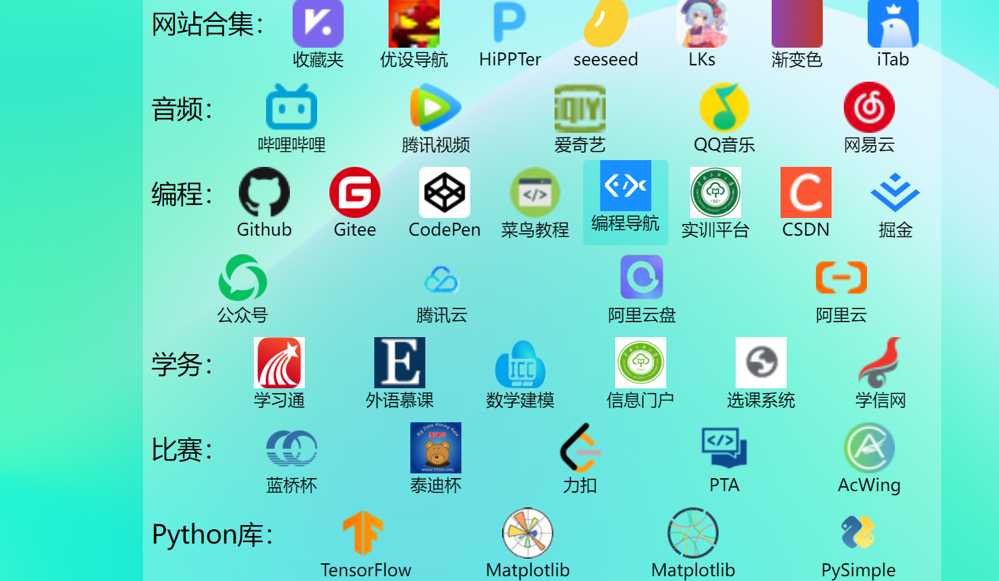
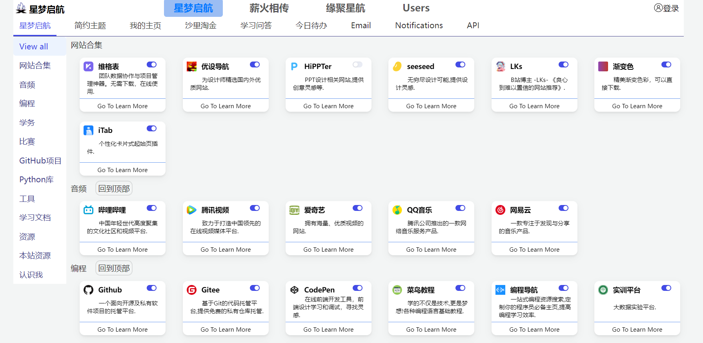
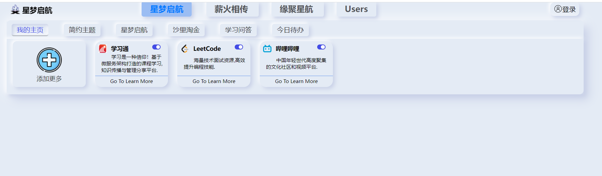

# StarDream-星梦启航

# 项目名称

`StarDream`-星梦启航

成品访问地址：http://www.stardream.vip/

身单力薄，UI设计不周望海涵，功底不牢，也望大佬不吝赐教。

[星梦启航2.0](http://www.stardream.vip:3000)

## 安装和使用

### 安装

说明如何安装您的项目，例如：

1. 下载或克隆此存储库。
2. 解压文件夹，添加喜欢页面到桌面为快捷方式

### 使用

1. 双击桌面的快捷方式即可

## 功能

快捷的打开一些网站

## 技术栈

大多是`html`，`css`,靠后使用了`nodejs`和`jquery`

## 联系方式

`QQemail`

2942581284@qq.com

## 常见问题

拓展性不足，图片没有使用精灵图